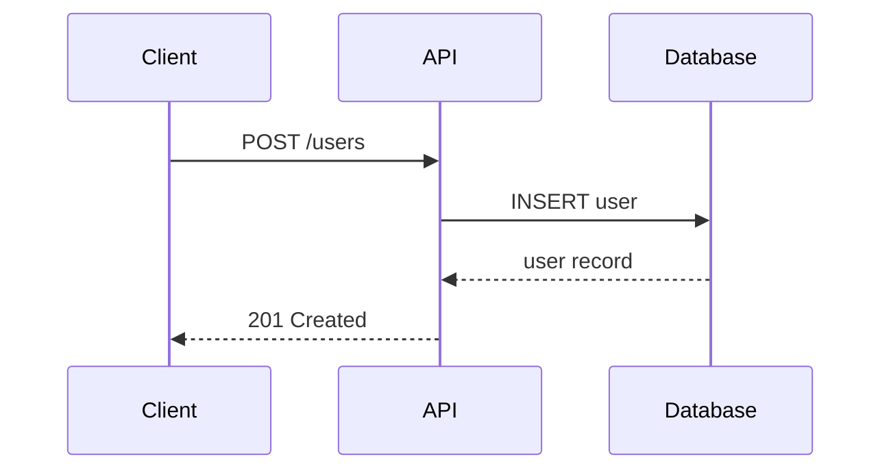
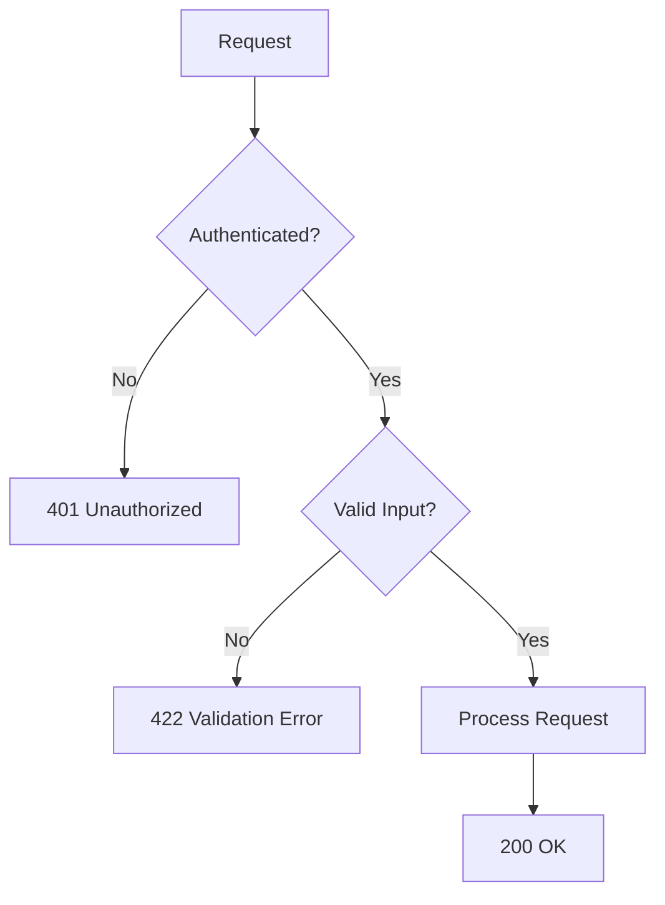
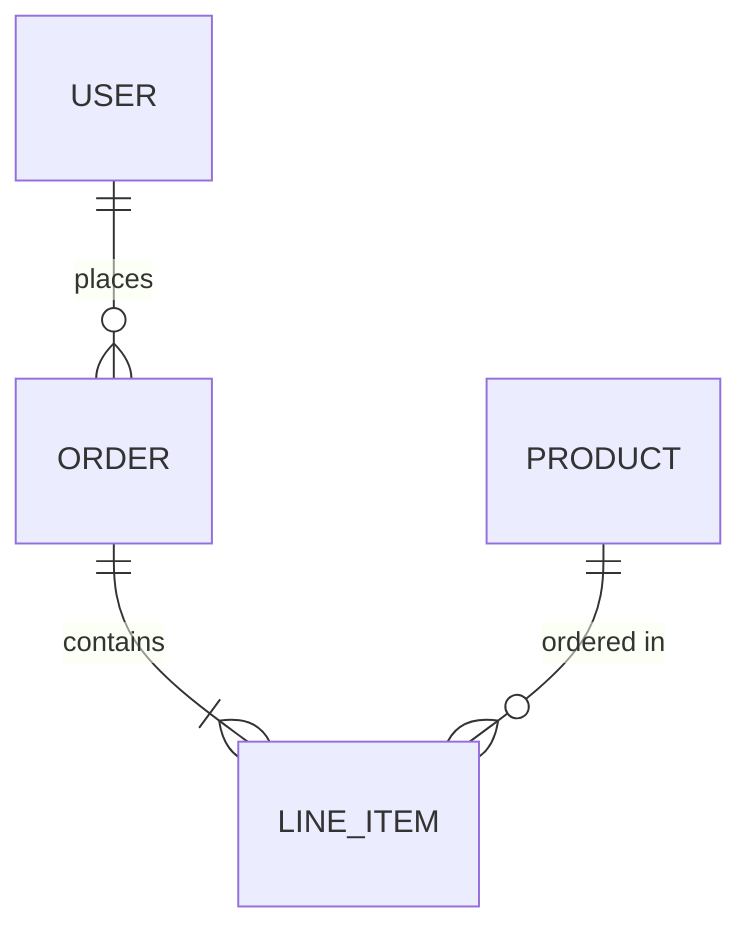

# API Documentation Templates

## REST Endpoint Documentation

Use this template for each API endpoint:

### Template

```markdown
## [Method] [Path]

[One-sentence description of what this endpoint does.]

### Request

**URL Parameters:**

| Name | Type | Required | Description |
|------|------|----------|-------------|
| `id` | string | Yes | The resource identifier |

**Query Parameters:**

| Name | Type | Required | Default | Description |
|------|------|----------|---------|-------------|
| `limit` | integer | No | 20 | Maximum results to return (1-100) |
| `cursor` | string | No | — | Pagination cursor from previous response |

**Request Body:**

| Field | Type | Required | Description | Constraints |
|-------|------|----------|-------------|-------------|
| `name` | string | Yes | Display name | 1-100 characters |
| `email` | string | Yes | Email address | Valid email format |

**Example Request:**

\```bash
curl -X POST https://api.example.com/v1/users \
  -H "Authorization: Bearer sk-abc123" \
  -H "Content-Type: application/json" \
  -d '{
    "name": "Jane Doe",
    "email": "jane@example.com"
  }'
\```

### Response

**Success (201 Created):**

\```json
{
  "id": "usr_abc123",
  "name": "Jane Doe",
  "email": "jane@example.com",
  "created_at": "2024-01-15T10:30:00Z"
}
\```

**Error Responses:**

| Status | Type | When |
|--------|------|------|
| 400 | validation-error | Invalid request body |
| 401 | authentication-required | Missing or expired token |
| 409 | resource-conflict | Email already registered |
| 429 | rate-limit-exceeded | Too many requests |
```

---

## Parameter Table Format

Always include these columns for parameters:

| Column | Purpose |
|--------|---------|
| **Name** | Parameter name as it appears in code |
| **Type** | Data type (string, integer, boolean, array, object) |
| **Required** | Yes / No |
| **Default** | Default value if optional (— if none) |
| **Description** | What this parameter does |
| **Constraints** | Validation rules (min/max, regex, enum values) |

### Example

| Name | Type | Required | Default | Description | Constraints |
|------|------|----------|---------|-------------|-------------|
| `page_size` | integer | No | 20 | Results per page | 1–100 |
| `status` | string | No | — | Filter by status | `active`, `inactive`, `pending` |
| `created_after` | string | No | — | Filter by creation date | ISO 8601 format |

---

## Request / Response Examples

### curl

```bash
curl -X GET "https://api.example.com/v1/users?status=active&limit=10" \
  -H "Authorization: Bearer sk-abc123" \
  -H "Accept: application/json"
```

### httpie

```bash
http GET https://api.example.com/v1/users \
  status==active limit==10 \
  Authorization:"Bearer sk-abc123"
```

### Python (requests)

```python
import requests

response = requests.get(
    "https://api.example.com/v1/users",
    params={"status": "active", "limit": 10},
    headers={"Authorization": "Bearer sk-abc123"},
)
data = response.json()
```

---

## Error Response Documentation

Document every error code an endpoint can return:

```markdown
### Errors

| Status | Error Type | Description | Example Detail |
|--------|-----------|-------------|---------------|
| 400 | `validation-error` | Request body is malformed | "Missing required field: 'name'" |
| 401 | `authentication-required` | Token missing or expired | "Access token has expired" |
| 403 | `insufficient-permissions` | Valid token, wrong scope | "Requires 'admin' scope" |
| 404 | `resource-not-found` | Resource doesn't exist | "No user with ID 'usr_999'" |
| 409 | `resource-conflict` | Duplicate or state conflict | "Email already registered" |
| 422 | `unprocessable-entity` | Valid syntax, invalid data | "Age must be positive" |
| 429 | `rate-limit-exceeded` | Too many requests | "Retry after 30 seconds" |
```

---

## OpenAPI / Swagger Annotations

### Python (FastAPI)

```python
@router.post(
    "/users",
    response_model=UserResponse,
    status_code=201,
    summary="Create a new user",
    description="Registers a new user account with the provided details.",
    responses={
        409: {"description": "Email already registered"},
        422: {"description": "Validation error"},
    },
)
async def create_user(user: UserCreate) -> UserResponse:
```

### TypeScript (NestJS / Swagger)

```typescript
@ApiOperation({ summary: 'Create a new user' })
@ApiResponse({ status: 201, description: 'User created', type: UserResponse })
@ApiResponse({ status: 409, description: 'Email already registered' })
@Post('users')
async createUser(@Body() dto: CreateUserDto): Promise<UserResponse> {
```

---

## Mermaid Diagram Quick Reference

### Sequence Diagram



### Flowchart



### Entity Relationship



### Tips

- Keep diagrams **under 10 nodes**. Split complex flows into multiple diagrams.
- Use descriptive labels on arrows (not just `-->` but `-->|description|`).
- Mermaid renders in GitHub, VS Code preview, and most documentation platforms.
- For architecture diagrams, prefer `flowchart` over `graph` (flowchart is the newer syntax).
